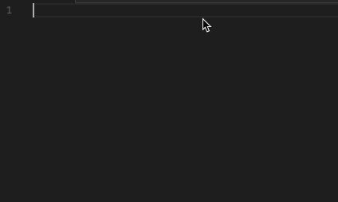

# Shopify Liquid Template Snippets for VS Code
This extension for Visual Studio Code adds snippets for Shopify Liquid Template.

## Prerequisite
[Liquid Languages Support](https://marketplace.visualstudio.com/items?itemName=neilding.language-liquid)

## Preview


## Usage
Type part of a snippet, press `enter`, and the snippet unfolds.

### Control Flow Tag
```javascript
if
else
elsif
ifelse
unless
case
when
```

### Iteration Tag
```javascript
cycle
cyclegroup
for
limit       // For loops option
offset      // For loops option
reversed    // For loops option
break
continue
tablerow
```

### Variable Tag
```javascript
assign
increment
decrement
capture
```

### Theme Tag
```javascript
include
includewith    // Theme Tag  with parameters
raw
layout
layoutnone
paginate
```

### Array Filter
```javascript
join
first
last
concat
map
reverse
size
sort
uniq
```

### HTML Filter
```javascript
img_tag
img_tag_param  // HTML Filter  with parameters
script_tag
stylesheet_tag
```

### Math Filter
```javascript
abs
ceil
divided_by
floor
minus
plus
round
times
modulo
```

### Money Filter
```javascript
money
money_with_currency
money_without_trailing_zeros
money_without_currency
```

### String Filter
```javascript
append
camelcase
captialize
downcase
escape
handleize
md5
newline_to_br
pluralize
prepend
remove
remove_first
replace
replace_first
slice
slice_single   // String Filter 'slice' with single parameter
split
strip
lstrip
rstrip
strip_html
strip_newlines
truncate
truncatewords
upcase
url_encode
url_escape
url_param_escape
```

### URL Filter
```javascript
asset_url
asset_img_url
img_url
```

Alternatively, press `Ctrl`+`Space` (Windows, Linux) or `Cmd`+`Space` (OSX) to activate snippets from within the editor.

## Installation

1. Install Visual Studio Code 0.10.1 or higher
2. Launch Code
3. From the command palette `Ctrl`-`Shift`-`P` (Windows, Linux) or `Cmd`-`Shift`-`P` (OSX)
4. Select `Install Extension`
5. Choose the extension
6. Reload Visual Studio Code
